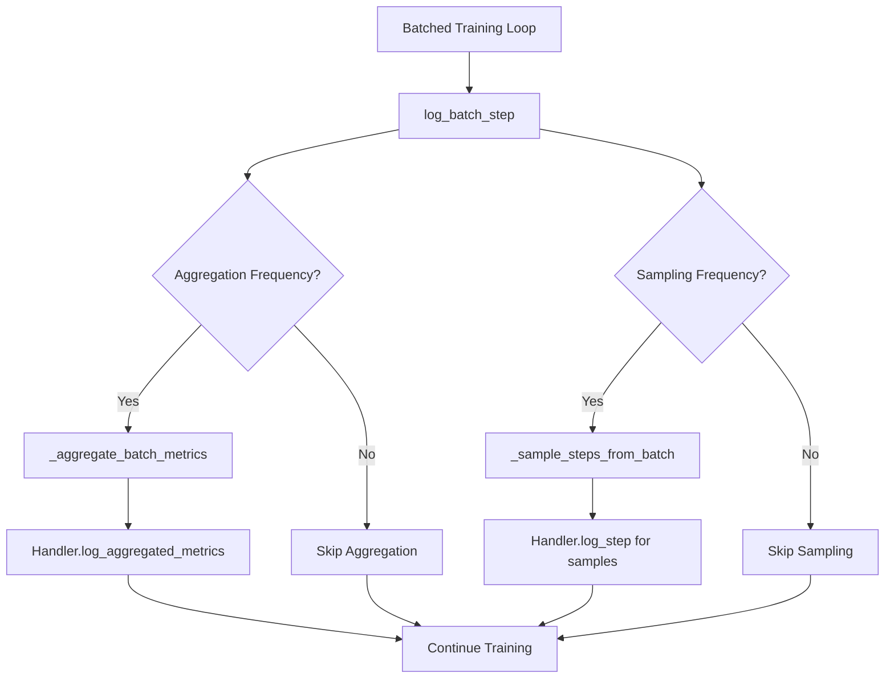

# Design Document

## Overview

This design extends the existing JaxARC logging system to support high-performance batched training scenarios while maintaining the same configurability and handler-based architecture. The solution introduces batched logging capabilities through a dual-strategy approach: aggregated metrics for performance monitoring and sampling for detailed debugging.

The design also includes cleanup of deprecated async logging settings to maintain a clean and focused codebase.

## Architecture

### Current Logging Architecture

The existing logging system follows a handler-based architecture:

```
ExperimentLogger (Central Coordinator)
├── FileHandler (JSON/Pickle output)
├── SVGHandler (Visual debugging)
├── RichHandler (Console output)
└── WandbHandler (Experiment tracking)
```

Each handler implements three methods:
- `log_task_start(task_data)` - Episode initialization
- `log_step(step_data)` - Individual step logging
- `log_episode_summary(summary_data)` - Episode completion

### Extended Architecture for Batched Logging

The batched logging extension adds a new method to the handler interface and introduces aggregation logic:

```
ExperimentLogger (Enhanced)
├── log_batch_step(batch_data) [NEW]
├── _aggregate_batch_metrics(batch_data) [NEW]
└── _sample_episodes_from_batch(batch_data) [NEW]

Handlers (Enhanced)
├── FileHandler
│   └── log_aggregated_metrics(metrics, step) [NEW]
├── SVGHandler (episode-level sampling for final states)
├── RichHandler
│   └── log_aggregated_metrics(metrics, step) [NEW]
└── WandbHandler
    └── log_aggregated_metrics(metrics, step) [NEW]
```

### Data Flow Architecture



## Components and Interfaces

### 1. Configuration System

#### New Batched Logging Configuration

Create `src/jaxarc/conf/logging/batched.yaml`:

```yaml
# @package logging
# Batched logging configuration for high-performance training

# Core logging settings (inherited from base)
structured_logging: true
log_format: "json"
log_level: "INFO"
compression: true
include_full_states: false

# Batched Training Specifics
batched_logging_enabled: true
log_frequency: 10 # Log aggregated metrics every N updates

# Representative Sampling (for detailed logs)
sampling_enabled: true
num_samples: 3 # Number of environments to sample
sample_frequency: 50 # Log samples every N updates

# Aggregated Metrics Selection
log_aggregated_rewards: true
log_aggregated_similarity: true
log_loss_metrics: true
log_gradient_norms: true
log_episode_lengths: true
log_success_rates: true
```

#### Updated LoggingConfig Dataclass

Remove async logging fields from `src/jaxarc/envs/config.py`:

```python
class LoggingConfig(eqx.Module):
    """All logging behavior and formats."""
    
    # Core logging settings
    structured_logging: bool = True
    log_format: Literal["json", "text", "structured"] = "json"
    log_level: Literal["DEBUG", "INFO", "WARNING", "ERROR"] = "INFO"
    compression: bool = True
    include_full_states: bool = False

    # What to log (specific content flags)
    log_operations: bool = False
    log_grid_changes: bool = False
    log_rewards: bool = False
    log_episode_start: bool = True
    log_episode_end: bool = True
    log_key_moments: bool = True

    # Logging frequency and timing
    log_frequency: int = 10

    # Batched logging settings [NEW]
    batched_logging_enabled: bool = False
    sampling_enabled: bool = True
    num_samples: int = 3
    sample_frequency: int = 50
    
    # Aggregated metrics selection [NEW]
    log_aggregated_rewards: bool = True
    log_aggregated_similarity: bool = True
    log_loss_metrics: bool = True
    log_gradient_norms: bool = True
    log_episode_lengths: bool = True
    log_success_rates: bool = True

    # REMOVED: All async logging fields
    # queue_size, worker_threads, batch_size, flush_interval, enable_compression
```

### 2. ExperimentLogger Extensions

#### New Batched Logging Method

```python
def log_batch_step(self, batch_data: Dict[str, Any]) -> None:
    """Log data from a batched training step.
    
    Args:
        batch_data: Dictionary containing:
            - update_step: Current training update number
            - episode_returns: Array of episode returns [batch_size]
            - episode_lengths: Array of episode lengths [batch_size]
            - similarity_scores: Array of similarity scores [batch_size]
            - policy_loss: Scalar policy loss
            - value_loss: Scalar value loss
            - gradient_norm: Scalar gradient norm
            - success_mask: Boolean array of episode successes [batch_size]
    """
    update_step = batch_data.get("update_step", 0)

    # Log aggregated metrics at specified frequency
    if (self.config.logging.batched_logging_enabled and 
        update_step % self.config.logging.log_frequency == 0):
        
        aggregated_metrics = self._aggregate_batch_metrics(batch_data)
        
        for handler_name, handler in self.handlers.items():
            try:
                if hasattr(handler, 'log_aggregated_metrics'):
                    handler.log_aggregated_metrics(aggregated_metrics, update_step)
            except Exception as e:
                logger.warning(f"Handler {handler_name} failed in log_aggregated_metrics: {e}")

    # Log sampled episode summaries at specified frequency
    if (self.config.logging.sampling_enabled and 
        update_step % self.config.logging.sample_frequency == 0):
        
        sampled_episodes = self._sample_episodes_from_batch(batch_data)
        
        for episode_data in sampled_episodes:
            self.log_episode_summary(episode_data)  # Reuse existing method
```

#### Aggregation Logic

```python
def _aggregate_batch_metrics(self, batch_data: Dict[str, Any]) -> Dict[str, float]:
    """Calculate aggregate metrics from batch data using JAX operations."""
    import jax.numpy as jnp
    
    metrics = {}
    
    # Episode returns aggregation
    if 'episode_returns' in batch_data and self.config.logging.log_aggregated_rewards:
        returns = batch_data['episode_returns']
        metrics.update({
            'reward_mean': float(jnp.mean(returns)),
            'reward_std': float(jnp.std(returns)),
            'reward_max': float(jnp.max(returns)),
            'reward_min': float(jnp.min(returns))
        })
    
    # Similarity scores aggregation
    if 'similarity_scores' in batch_data and self.config.logging.log_aggregated_similarity:
        similarities = batch_data['similarity_scores']
        metrics.update({
            'similarity_mean': float(jnp.mean(similarities)),
            'similarity_std': float(jnp.std(similarities)),
            'similarity_max': float(jnp.max(similarities)),
            'similarity_min': float(jnp.min(similarities))
        })
    
    # Episode lengths aggregation
    if 'episode_lengths' in batch_data and self.config.logging.log_episode_lengths:
        lengths = batch_data['episode_lengths']
        metrics.update({
            'episode_length_mean': float(jnp.mean(lengths)),
            'episode_length_std': float(jnp.std(lengths)),
            'episode_length_max': float(jnp.max(lengths)),
            'episode_length_min': float(jnp.min(lengths))
        })
    
    # Success rate calculation
    if 'success_mask' in batch_data and self.config.logging.log_success_rates:
        success_mask = batch_data['success_mask']
        metrics['success_rate'] = float(jnp.mean(success_mask))
    
    # Training loss metrics (scalars)
    if 'policy_loss' in batch_data and self.config.logging.log_loss_metrics:
        metrics['policy_loss'] = float(batch_data['policy_loss'])
    
    if 'value_loss' in batch_data and self.config.logging.log_loss_metrics:
        metrics['value_loss'] = float(batch_data['value_loss'])
    
    # Gradient norms
    if 'gradient_norm' in batch_data and self.config.logging.log_gradient_norms:
        metrics['gradient_norm'] = float(batch_data['gradient_norm'])
    
    return metrics
```

#### Episode Sampling Logic

```python
def _sample_episodes_from_batch(self, batch_data: Dict[str, Any]) -> List[Dict[str, Any]]:
    """Extract sample of episode summaries from batch for detailed logging.
    
    Note: This focuses on episode-level data rather than step-by-step data,
    as intermediate states are not typically stored in batched training for
    performance reasons.
    """
    import jax
    import jax.numpy as jnp
    
    num_samples = self.config.logging.num_samples
    batch_size = batch_data['episode_returns'].shape[0]
    
    # Sample all if requested samples >= batch size
    if num_samples >= batch_size:
        sample_indices = jnp.arange(batch_size)
    else:
        # Deterministic sampling based on update step for reproducibility
        key = jax.random.PRNGKey(batch_data.get("update_step", 0))
        sample_indices = jax.random.choice(
            key, batch_size, shape=(num_samples,), replace=False
        )
    
    sampled_episodes = []
    for i in sample_indices:
        # Reconstruct episode summary data for existing log_episode_summary method
        episode_summary = {
            "episode_num": batch_data.get("update_step", 0),  # Use update step as episode identifier
            "total_reward": float(batch_data['episode_returns'][i]),
            "total_steps": int(batch_data['episode_lengths'][i]) if 'episode_lengths' in batch_data else 0,
            "final_similarity": float(batch_data['similarity_scores'][i]) if 'similarity_scores' in batch_data else 0.0,
            "success": bool(batch_data['success_mask'][i]) if 'success_mask' in batch_data else False,
            "environment_id": int(i),
            "task_id": batch_data.get('task_ids', [f"batch_task_{i}"])[i] if 'task_ids' in batch_data else f"batch_task_{i}",
            
            # Optional: Include final states if available for SVG visualization
            "initial_state": batch_data.get('initial_states', [None])[i] if 'initial_states' in batch_data else None,
            "final_state": batch_data.get('final_states', [None])[i] if 'final_states' in batch_data else None,
        }
        sampled_episodes.append(episode_summary)
    
    return sampled_episodes
```

### 3. Handler Extensions

#### WandbHandler Extension

```python
def log_aggregated_metrics(self, metrics: Dict[str, float], step: int) -> None:
    """Log aggregated batch metrics to wandb."""
    if self.run is None:
        return
    
    try:
        # Add batch prefix to distinguish from individual step metrics
        batch_metrics = {f"batch/{key}": value for key, value in metrics.items()}
        self.run.log(batch_metrics, step=step)
        logger.debug(f"Logged {len(batch_metrics)} batch metrics to wandb")
    except Exception as e:
        logger.warning(f"Wandb batch logging failed: {e}")
```

#### FileHandler Extension

```python
def log_aggregated_metrics(self, metrics: Dict[str, float], step: int) -> None:
    """Log aggregated metrics to file."""
    try:
        # Create batch metrics file if it doesn't exist
        batch_metrics_file = self.output_dir / "batch_metrics.jsonl"
        
        # Append metrics with timestamp
        import time
        import json
        
        log_entry = {
            "timestamp": time.time(),
            "step": step,
            "metrics": metrics
        }
        
        with open(batch_metrics_file, 'a') as f:
            f.write(json.dumps(log_entry) + '\n')
            
        logger.debug(f"Logged batch metrics to {batch_metrics_file}")
    except Exception as e:
        logger.warning(f"File batch logging failed: {e}")
```

#### RichHandler Extension

```python
def log_aggregated_metrics(self, metrics: Dict[str, float], step: int) -> None:
    """Display aggregated metrics to console."""
    try:
        from rich.table import Table
        
        # Create metrics table
        table = Table(title=f"Batch Metrics - Step {step}")
        table.add_column("Metric", style="cyan")
        table.add_column("Value", style="green")
        
        # Group metrics by category
        reward_metrics = {k: v for k, v in metrics.items() if k.startswith('reward_')}
        similarity_metrics = {k: v for k, v in metrics.items() if k.startswith('similarity_')}
        training_metrics = {k: v for k, v in metrics.items() if k in ['policy_loss', 'value_loss', 'gradient_norm']}
        
        # Add metrics to table
        for category, category_metrics in [
            ("Rewards", reward_metrics),
            ("Similarity", similarity_metrics), 
            ("Training", training_metrics)
        ]:
            if category_metrics:
                table.add_row(f"[bold]{category}[/bold]", "")
                for key, value in category_metrics.items():
                    display_key = key.replace('_', ' ').title()
                    table.add_row(f"  {display_key}", f"{value:.4f}")
        
        self.console.print(table)
    except Exception as e:
        logger.warning(f"Rich batch logging failed: {e}")
```

## Data Models

### Batch Data Structure

The `batch_data` dictionary passed to `log_batch_step` should contain:

```python
batch_data = {
    # Training metadata
    "update_step": int,  # Current training update number
    
    # Environment metrics (arrays with shape [batch_size])
    "episode_returns": jnp.ndarray,  # Episode returns
    "episode_lengths": jnp.ndarray,  # Episode lengths
    "similarity_scores": jnp.ndarray,  # Final similarity scores
    "success_mask": jnp.ndarray,  # Boolean success indicators
    
    # Training metrics (scalars)
    "policy_loss": float,  # Policy loss
    "value_loss": float,  # Value loss
    "gradient_norm": float,  # Gradient norm
    
    # Optional: Additional training metrics
    "entropy": float,  # Policy entropy
    "explained_variance": float,  # Value function explained variance
    "learning_rate": float,  # Current learning rate
    
    # Optional: Episode-level data for detailed logging (if available)
    "task_ids": List[str],  # Task identifiers for each environment
    "initial_states": List[Any],  # Initial states for SVG visualization
    "final_states": List[Any],  # Final states for SVG visualization
}
```

### SVG Handler Considerations

The SVGHandler has special considerations for batched logging:

1. **No Step-by-Step Visualization**: In batched training, intermediate states are not stored for performance reasons. The SVGHandler will not attempt to visualize step-by-step transitions.

2. **Episode-Level Visualization**: When sampling is enabled, the SVGHandler can visualize initial vs. final states for sampled episodes if this data is provided in the batch_data.

3. **Graceful Degradation**: If state data is not available, the SVGHandler will skip visualization without errors, allowing other handlers to continue functioning.

This approach maintains the performance benefits of batched training while still providing valuable visual debugging information for a subset of episodes.

### Configuration Updates

Remove from all YAML files and LoggingConfig:
- `queue_size`
- `worker_threads` 
- `batch_size` (logging batch_size, not training batch_size)
- `flush_interval`
- `enable_compression` (async-specific)

## Error Handling

### Handler Isolation

The existing error isolation pattern continues to apply:
- Failures in one handler don't affect others
- Warnings are logged but training continues
- Graceful degradation when handlers are unavailable

### Configuration Validation

```python
def validate_batched_logging_config(config: LoggingConfig) -> List[str]:
    """Validate batched logging configuration."""
    errors = []
    
    if config.num_samples <= 0:
        errors.append("num_samples must be positive")
    
    if config.sample_frequency <= 0:
        errors.append("sample_frequency must be positive")
    
    if config.log_frequency <= 0:
        errors.append("log_frequency must be positive")
    
    if config.num_samples > 1000:
        logger.warning(f"num_samples is very large: {config.num_samples}")
    
    return errors
```

## Testing Strategy

### Unit Tests

1. **Configuration Tests**
   - Validate batched logging config loading
   - Test async logging field removal
   - Verify configuration validation

2. **ExperimentLogger Tests**
   - Test `log_batch_step` method
   - Test aggregation logic with mock data
   - Test sampling logic with various batch sizes

3. **Handler Tests**
   - Test `log_aggregated_metrics` for each handler
   - Test error isolation with failing handlers
   - Test integration with existing `log_step` method

### Integration Tests

1. **End-to-End Batched Logging**
   - Test complete batched logging pipeline
   - Verify file outputs and wandb integration
   - Test performance with large batches

2. **Configuration Migration**
   - Test loading old configs without async settings
   - Verify new batched configs work correctly

### Performance Tests

1. **Aggregation Performance**
   - Benchmark JAX aggregation operations
   - Test with various batch sizes (100, 1000, 10000)
   - Verify JIT compilation works correctly

2. **Memory Usage**
   - Monitor memory usage during batched logging
   - Test sampling efficiency with large batches

## Migration Strategy

### Phase 1: Cleanup Async Logging
1. Remove async logging fields from YAML configs
2. Update LoggingConfig dataclass
3. Remove unused async logging code
4. Update tests

### Phase 2: Add Batched Configuration
1. Create `batched.yaml` configuration
2. Add batched fields to LoggingConfig
3. Add configuration validation

### Phase 3: Extend ExperimentLogger
1. Add `log_batch_step` method
2. Implement aggregation and sampling logic
3. Add comprehensive tests

### Phase 4: Extend Handlers
1. Add `log_aggregated_metrics` to each handler
2. Test integration with existing methods
3. Update handler tests

### Phase 5: Integration and Documentation
1. End-to-end integration testing
2. Performance benchmarking
3. Update documentation and examples