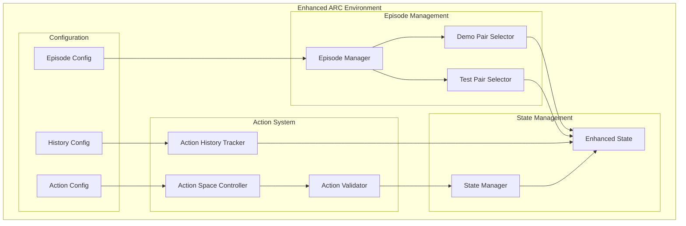

# Design Document

## Overview

This design enhances the ARC environment's step logic to support sophisticated
multi-demonstration training, test pair evaluation, action history tracking, and
flexible action space control. The design maintains full JAX compatibility while
providing the flexibility needed for advanced RL research on ARC tasks.

The enhancement transforms the current single-demonstration, stateless approach
into a comprehensive system that can handle all aspects of ARC task structure:
multiple training demonstrations, separate test evaluation, complete action
tracking, and dynamic action space management.

### Key Insights from ARCLE Analysis

Analysis of existing ARCLE implementations provides useful reference points:

1. **Mode Separation**: Clear distinction between training (with target access)
   and evaluation (without target access) is crucial for proper RL training.

2. **Flexible Pair Selection**: Supporting both single-pair-per-episode and
   multi-pair strategies gives researchers more experimental flexibility than
   ARCLE's single-pair limitation.

3. **Reward Structure Adaptation**: Different reward structures for training vs
   evaluation modes, but our approach allows more granular control.

4. **Episode Management**: Our design supports more sophisticated episode
   management than ARCLE's simple random selection.

Our approach improves upon ARCLE by:

- Supporting both sequential and random multi-demonstration training
- Providing configurable episode termination criteria
- Implementing comprehensive action history tracking
- Offering context-aware action space control
- Maintaining full JAX compatibility for performance
- Using consistent non-parametric actions for simplicity

### Non-Parametric Action Design Benefits

The decision to use non-parametric control operations provides several
advantages:

1. **Consistency**: All actions follow the same `{selection, operation}` format
2. **Simplicity**: No need for complex parameter validation or mixed action
   types
3. **Agent Compatibility**: Standard RL agents can handle the action space
   without modification
4. **JAX Efficiency**: Uniform action structure is more efficient for JIT
   compilation
5. **Extensibility**: Easy to add new control operations without changing action
   format

The trade-off is slightly more operations (next/prev instead of direct
indexing), but this provides better semantic meaning and is more intuitive for
agents to learn.

## Architecture

### Core Design Principles

1. **JAX-First Design**: All enhancements maintain static shapes, pure
   functions, and JIT compatibility
2. **Configuration-Driven**: All new functionality is configurable through the
   existing Hydra system
3. **Backward Compatibility**: Existing code continues to work with sensible
   defaults
4. **Performance-Oriented**: Efficient vectorization and minimal overhead for
   batch processing
5. **Extensible**: Architecture supports future enhancements like hierarchical
   RL and meta-learning

### High-Level Architecture



## Components and Interfaces

### 1. Enhanced State Management

#### Enhanced ArcEnvState

The current `ArcEnvState` will be extended with new fields while maintaining JAX
compatibility:

```python
class ArcEnvState(eqx.Module):
    # Existing fields (unchanged)
    task_data: JaxArcTask
    working_grid: GridArray
    working_grid_mask: MaskArray
    target_grid: GridArray
    step_count: StepCount
    episode_done: EpisodeDone
    current_example_idx: EpisodeIndex
    selected: SelectionArray
    clipboard: GridArray
    similarity_score: SimilarityScore

    # New fields for enhanced functionality
    episode_mode: EpisodeMode  # "train" or "test"
    available_demo_pairs: AvailablePairs  # Mask of available training pairs
    available_test_pairs: AvailablePairs  # Mask of available test pairs
    demo_completion_status: CompletionStatus  # Per-demo completion tracking
    test_completion_status: CompletionStatus  # Per-test completion tracking
    action_history: ActionHistory  # Fixed-size action sequence
    action_history_length: HistoryLength  # Current history length
    allowed_operations_mask: OperationMask  # Dynamic operation filtering
```

#### New JAX Types

```python
# Episode management types
EpisodeMode = Int[Array, ""]  # 0=train, 1=test for JAX compatibility
AvailablePairs = Bool[Array, "max_pairs"]  # Mask of available pairs
CompletionStatus = Bool[Array, "max_pairs"]  # Per-pair completion status

# Action history types
ActionHistory = Float[
    Array, "max_history_length action_record_fields"
]  # Structured records
HistoryLength = Int[Array, ""]
OperationMask = Bool[
    Array, "num_operations"
]  # Dynamic operation filtering (updated to 42 ops)
```

### 2. Episode Management System

#### EpisodeManager

Handles the logic for managing training and test episodes with non-parametric
control:

```python
class EpisodeManager:
    """Manages episode lifecycle and demonstration/test pair selection."""

    def select_initial_pair(
        self,
        key: PRNGKey,
        task_data: JaxArcTask,
        mode: EpisodeMode,
        config: EpisodeConfig,
    ) -> tuple[int, GridArray, GridArray]:
        """Select initial demonstration or test pair."""

    def should_continue_episode(
        self, state: ArcEnvState, config: EpisodeConfig
    ) -> bool:
        """Determine if episode should continue or terminate."""

    def execute_pair_control_operation(
        self, state: ArcEnvState, operation_id: int, config: EpisodeConfig
    ) -> ArcEnvState:
        """Execute non-parametric pair control operations.

        Handles operations like:
        - SWITCH_TO_NEXT_DEMO_PAIR: Move to next available demo pair
        - SWITCH_TO_PREV_DEMO_PAIR: Move to previous demo pair
        - SWITCH_TO_FIRST_UNSOLVED_DEMO: Jump to first unsolved demo
        - Similar operations for test pairs
        """
```

#### Episode Configuration

```python
@chex.dataclass
class EpisodeConfig:
    """Configuration for episode management behavior."""

    # Mode settings
    episode_mode: Literal["train", "test"] = "train"

    # Multi-demonstration settings
    demo_selection_strategy: Literal["sequential", "random"] = "random"
    allow_demo_switching: bool = True
    require_all_demos_solved: bool = False

    # Test evaluation settings
    test_selection_strategy: Literal["sequential", "random"] = "sequential"
    allow_test_switching: bool = False
    require_all_tests_solved: bool = True

    # Termination criteria
    terminate_on_first_success: bool = False
    max_pairs_per_episode: int = 4
    success_threshold: float = 1.0

    # Reward settings
    training_reward_frequency: Literal["step", "submit"] = "step"
    evaluation_reward_frequency: Literal["submit"] = "submit"
```

### 3. Action History Tracking

#### ActionHistoryTracker

Maintains a complete record of actions taken during an episode:

```python
class ActionHistoryTracker:
    """Tracks action sequences with JAX-compatible fixed-size storage."""

    def add_action(
        self, state: ArcEnvState, action: dict, config: HistoryConfig
    ) -> ArcEnvState:
        """Add action to history with proper indexing."""

    def get_action_sequence(
        self, state: ArcEnvState, start_idx: int = 0, end_idx: Optional[int] = None
    ) -> ActionSequence:
        """Extract action sequence from history."""

    def clear_history(self, state: ArcEnvState) -> ArcEnvState:
        """Clear action history for new episode."""
```

#### Action History Storage

```python
# Fixed-size action storage for JAX compatibility
@chex.dataclass
class ActionRecord:
    """Single action record with all necessary information."""

    selection_data: SelectionData  # Flattened selection (point/bbox/mask)
    operation_id: OperationId
    timestamp: StepCount
    pair_index: EpisodeIndex  # Which demo/test pair this action was on
    valid: bool  # Whether this record contains valid data


# History storage
ActionHistory = ActionRecord[Array, "max_history_length"]
```

#### History Configuration

```python
@chex.dataclass
class HistoryConfig:
    """Configuration for action history tracking."""

    enabled: bool = True
    max_history_length: int = 1000
    store_selection_data: bool = True
    store_intermediate_grids: bool = False  # Memory-intensive option
    compress_repeated_actions: bool = True
```

### 4. Enhanced Action Space Control

#### ActionSpaceController

Provides basic control over available operations with context awareness:

```python
class ActionSpaceController:
    """Controls which operations are available at runtime."""

    def get_allowed_operations(
        self, state: ArcEnvState, config: ActionConfig
    ) -> OperationMask:
        """Get current allowed operations mask based on configuration and context.

        Context-aware filtering:
        - Demo pair switching only available in train mode with multiple demos
        - Test pair switching only available in test mode with multiple tests
        - Pair reset only available if current pair has been modified
        """

    def validate_operation(
        self, operation_id: int, state: ArcEnvState, config: ActionConfig
    ) -> tuple[bool, Optional[str]]:
        """Validate if operation is currently allowed in current context."""

    def filter_invalid_operation(
        self, operation_id: int, state: ArcEnvState, config: ActionConfig
    ) -> int:
        """Filter invalid operations according to policy (clip, reject, etc)."""
```

#### Enhanced Action Configuration

```python
@chex.dataclass
class EnhancedActionConfig:
    """Extended action configuration with basic dynamic control."""

    # Existing fields (unchanged)
    selection_format: Literal["mask", "point", "bbox"] = "mask"
    selection_threshold: float = 0.5
    allow_partial_selection: bool = True
    max_operations: int = 35
    allowed_operations: Optional[list[int]] = None
    validate_actions: bool = True
    allow_invalid_actions: bool = False

    # Simple dynamic control
    dynamic_action_filtering: bool = False  # Enable runtime operation filtering
    context_dependent_operations: bool = (
        False  # Allow context-based operation availability
    )
```

## Data Models

### Enhanced Task Representation

The existing `JaxArcTask` structure supports the required functionality, but
we'll add utility methods:

```python
class JaxArcTask(eqx.Module):
    # Existing fields (unchanged)

    def get_available_demo_pairs(self) -> AvailablePairs:
        """Get mask of available training pairs."""
        return jnp.arange(self.input_grids_examples.shape[0]) < self.num_train_pairs

    def get_available_test_pairs(self) -> AvailablePairs:
        """Get mask of available test pairs."""
        return jnp.arange(self.test_input_grids.shape[0]) < self.num_test_pairs

    def get_demo_pair_data(
        self, pair_idx: int
    ) -> tuple[GridArray, GridArray, MaskArray]:
        """Get training pair data by index."""
        return (
            self.input_grids_examples[pair_idx],
            self.output_grids_examples[pair_idx],
            self.input_masks_examples[pair_idx],
        )

    def get_test_pair_data(self, pair_idx: int) -> tuple[GridArray, MaskArray]:
        """Get test pair input data by index (no target during evaluation)."""
        return (self.test_input_grids[pair_idx], self.test_input_masks[pair_idx])
```

### Enhanced Observation Space

The observation space uses a **separate ArcObservation structure** that provides
a clean, focused view of the environment state for agents. This separation
provides several key advantages:

1. **Information Hiding**: Prevents agents from seeing internal implementation
   details
2. **Partial Observability**: Models realistic scenarios where agents don't have
   full state access
3. **Research Flexibility**: Allows experimenting with different observation
   configurations
4. **Reduced Input Size**: Smaller, focused observation space for more efficient
   agent training
5. **Clean API**: Clear separation between environment internals and agent
   interface

```python
@chex.dataclass
class ArcObservation:
    """Agent observation space - focused view of environment state."""

    # Core grid information (what agent directly works with)
    working_grid: GridArray  # Current grid being modified
    working_grid_mask: MaskArray  # Valid cells mask

    # Episode context (what agent needs to know)
    episode_mode: EpisodeMode  # 0=train, 1=test
    current_pair_idx: EpisodeIndex  # Which pair is currently active
    step_count: StepCount  # Number of steps taken

    # Progress tracking (helps agent understand accomplishments)
    demo_completion_status: CompletionStatus  # Which demo pairs are solved
    test_completion_status: CompletionStatus  # Which test pairs are solved

    # Action space information (what agent can do)
    allowed_operations_mask: OperationMask  # Currently allowed operations

    # Target information (training only, masked in test mode)
    target_grid: Optional[GridArray] = None  # Only available in train mode

    # Optional: Recent action history (configurable)
    recent_actions: Optional[ActionHistory] = None  # Last N actions if enabled


@chex.dataclass
class ObservationConfig:
    """Configuration for observation space construction."""

    # Core observation components
    include_target_grid: bool = True  # Include target in train mode
    include_completion_status: bool = True  # Include progress tracking
    include_action_space_info: bool = True  # Include allowed operations

    # Optional components
    include_recent_actions: bool = False  # Include recent action history
    recent_action_count: int = 10  # How many recent actions to include
    include_step_count: bool = True  # Include step counter

    # Research flexibility options
    observation_format: Literal["minimal", "standard", "rich"] = "standard"
    mask_internal_state: bool = True  # Hide internal implementation details
```

**What agents see (ArcObservation):**

- Core grids and masks they need to work with
- Current episode context and progress
- Available actions and constraints
- Target grid (only in training mode)
- Optional recent action history

**What stays internal (ArcEnvState only):**

- Full task_data structure and raw dataset details
- Internal clipboard state and intermediate computations
- Complete action history (vs recent subset)
- Available pairs masks and internal bookkeeping
- Similarity scores and internal state management

### Enhanced Action Space Design

We maintain the existing non-parametric action format for consistency and
simplicity:

```python
# Consistent non-parametric action format
ActionType = {
    "selection": SelectionData,  # Point/bbox/mask selection (used for grid ops)
    "operation": OperationId,  # Operation ID (0-N)
}

# Updated operation set with non-parametric control operations
ARCLE_OPERATIONS = {
    # Original ARCLE operations (0-34)
    **ARCLE_OPERATIONS,
    # New control operations (35+)
    35: "SWITCH_TO_NEXT_DEMO_PAIR",  # Switch to next available demo pair
    36: "SWITCH_TO_PREV_DEMO_PAIR",  # Switch to previous demo pair
    37: "SWITCH_TO_NEXT_TEST_PAIR",  # Switch to next available test pair
    38: "SWITCH_TO_PREV_TEST_PAIR",  # Switch to previous test pair
    39: "RESET_CURRENT_PAIR",  # Reset current pair to initial state
    40: "SWITCH_TO_FIRST_UNSOLVED_DEMO",  # Switch to first unsolved demo pair
    41: "SWITCH_TO_FIRST_UNSOLVED_TEST",  # Switch to first unsolved test pair
}

# Selection field usage for control operations:
# - Grid operations (0-34): selection used for spatial targeting
# - Control operations (35+): selection field ignored or used for simple flags
```

### State Transition Functions

```python
# Enhanced reset function
def enhanced_arc_reset(
    key: PRNGKey,
    config: JaxArcConfig,
    task_data: Optional[JaxArcTask] = None,
    episode_mode: EpisodeMode = "train",
    initial_pair_idx: Optional[int] = None,
) -> tuple[ArcEnvState, ArcObservation]:
    """Enhanced reset with multi-demonstration support.

    Returns:
        Tuple of (enhanced_state, focused_observation)
    """


# Enhanced step function
def enhanced_arc_step(
    state: ArcEnvState, action: ActionType, config: JaxArcConfig
) -> tuple[ArcEnvState, ArcObservation, RewardValue, EpisodeDone, dict]:
    """Enhanced step with separate state and observation.

    Key features:
    - Separate ArcObservation provides focused agent view
    - Enhanced action space with additional control operations
    - Efficient action history tracking with configurable storage
    - Configurable observation space for research flexibility

    Returns:
        Tuple of (new_state, agent_observation, reward, done, info)
    """


# Observation construction function
def create_observation(state: ArcEnvState, config: ObservationConfig) -> ArcObservation:
    """Create agent observation from environment state.

    This function extracts relevant information from the full environment state
    and constructs a focused observation for the agent, hiding internal
    implementation details and providing configurable observation formats.
    """
```

## Error Handling

### Validation Strategy

1. **Configuration Validation**: Comprehensive validation of all new
   configuration options
2. **Runtime Validation**: JAX-compatible validation of state transitions and
   action validity
3. **Graceful Degradation**: Fallback to simpler behavior when advanced features
   fail
4. **Clear Error Messages**: Detailed error reporting for debugging

### Error Types

```python
class EpisodeConfigurationError(Exception):
    """Raised when episode configuration is invalid."""


class ActionHistoryError(Exception):
    """Raised when action history operations fail."""


class ActionSpaceError(Exception):
    """Raised when action space control encounters issues."""
```

## Testing Strategy

### Unit Testing

1. **State Management Tests**: Verify enhanced state transitions and validation
2. **Episode Management Tests**: Test demonstration/test pair selection and
   switching
3. **Action History Tests**: Validate history tracking and retrieval
4. **Action Space Tests**: Test dynamic operation control and validation

### Integration Testing

1. **Multi-Demonstration Training**: End-to-end testing of multiple
   demonstration training
2. **Test Evaluation**: Comprehensive testing of test pair evaluation mode
3. **JAX Compatibility**: Verify all enhancements work with JAX transformations
4. **Performance Testing**: Ensure enhancements don't significantly impact
   performance

### Property-Based Testing

1. **State Invariants**: Use Hypothesis to verify state consistency across
   transitions
2. **Action History Integrity**: Test that history accurately reflects action
   sequences
3. **Configuration Compatibility**: Test various configuration combinations

## Performance Considerations

### Memory Optimization

1. **Configurable History Storage**: Action history with optional selection data
   storage

   ```python
   # Memory-efficient history configuration
   history_config = HistoryConfig(
       max_history_length=100,  # Reasonable default
       store_selection_data=False,  # Save memory by storing only operation IDs
       store_intermediate_grids=False,  # Disable for production training
       compress_repeated_actions=True,  # Reduce storage for repeated operations
   )
   ```

2. **Efficient State Updates**: Use Equinox tree_at for minimal copying
3. **Optional Features**: All memory-intensive features can be disabled via
   configuration

### Computational Efficiency

1. **JIT Compilation**: All new functions designed for JIT compatibility
2. **Vectorization**: Efficient batching with vmap across demonstration pairs
3. **Lazy Observation Construction**: Build observations only when needed

### Memory Impact Analysis

| Feature                 | Memory Impact            | Mitigation                        |
| ----------------------- | ------------------------ | --------------------------------- |
| Action History          | High (selection masks)   | Configurable storage, compression |
| Enhanced State          | Medium (new fields)      | Static shapes, efficient packing  |
| Structured Observations | Low (computed on demand) | Lazy construction                 |
| Multi-pair tracking     | Low (boolean masks)      | Fixed-size arrays                 |

### Scalability Benchmarks

Target performance metrics:

- **Batch Size**: Support 1000+ parallel environments
- **Memory Overhead**: <20% increase with default settings
- **Step Latency**: <10% increase in step time
- **JIT Compatibility**: All functions must compile successfully

## Migration Strategy

### Backward Compatibility

1. **Default Behavior**: New features are opt-in with sensible defaults
2. **Legacy Support**: Existing code continues to work without modification
3. **Gradual Migration**: Users can adopt new features incrementally

### Configuration Migration

1. **Automatic Upgrades**: Detect and upgrade legacy configurations
2. **Validation Warnings**: Clear warnings about deprecated patterns
3. **Migration Tools**: Utilities to help users transition to new configuration
   format
