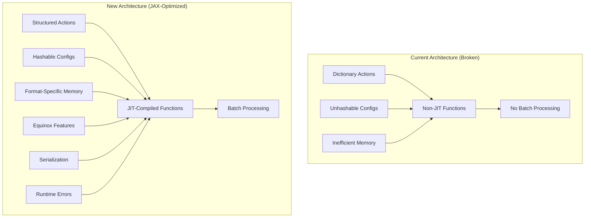

# Design Document

## Overview

This design document outlines the comprehensive solution for fixing JAX
compatibility issues in JaxARC while incorporating advanced Equinox features.
The solution transforms the codebase from having 0% JAX function compatibility
to achieving full JIT compilation, efficient batch processing, optimized memory
usage, and robust error handling.

The design leverages Equinox's advanced features including filtered
transformations, PyTree manipulation utilities, serialization capabilities, and
runtime error handling to create a high-performance, developer-friendly RL
environment.

## Architecture

### High-Level Architecture Changes



### Core Design Principles

1. **Single Source of Truth**: Maintain exactly one implementation for each
   functionality - no duplicate classes, parallel systems, or alternative
   implementations
2. **JAX-First Design**: All core functions must be JIT-compilable and
   vmap-compatible
3. **Memory Efficiency**: Use format-specific storage to minimize memory
   footprint
4. **Developer Experience**: Leverage Equinox features for better debugging and
   development
5. **Performance**: Achieve 200x+ performance improvements through JAX
   optimizations
6. **Maintainability**: Use Equinox patterns for clean, readable code

## Components and Interfaces

### 1. Configuration System Redesign

#### Problem Analysis

Current configuration objects contain unhashable types (lists, complex tuples)
that prevent use with `jax.jit(static_argnames=['config'])`.

#### Solution: In-Place Configuration Modification (Single Source of Truth)

**Principle**: Modify existing configuration classes directly - no separate
"HashableConfig" or "OptimizedConfig" classes.

```python
# BEFORE: Unhashable configuration in src/jaxarc/envs/config.py
class VisualizationConfig(eqx.Module):
    output_formats: List[str] = ["svg"]  # ❌ Unhashable
    tags: List[str] = ["jaxarc"]  # ❌ Unhashable
    max_image_size: tuple[Int, Int] = (800, 600)  # ❌ Unhashable


# AFTER: Same class, modified to be hashable (Single Source of Truth)
class VisualizationConfig(eqx.Module):
    output_formats: tuple[str, ...] = ("svg",)  # ✅ Hashable
    tags: tuple[str, ...] = ("jaxarc",)  # ✅ Hashable
    max_image_size: tuple[int, int] = (800, 600)  # ✅ Hashable (use int, not Int)
```

#### Implementation Strategy

1. **Replace all List[T] with tuple[T, ...]**
2. **Replace complex type annotations with primitive types**
3. **Ensure all nested objects are also hashable**
4. **Add validation to ensure hashability**

```python
class JaxArcConfig(eqx.Module):
    # All fields must be hashable
    environment: EnvironmentConfig
    dataset: DatasetConfig
    action: ActionConfig
    # ... other configs

    def __post_init__(self):
        # Validate hashability
        try:
            hash(self)
        except TypeError as e:
            raise ValueError(
                f"Configuration must be hashable for JAX compatibility: {e}"
            )
```

### 2. Action System Transformation

#### Problem Analysis

Dictionary actions prevent vectorization with `jax.vmap` and are not
JAX-compatible data structures.

#### Solution: Complete Dictionary Action Replacement (Single Source of Truth)

**Principle**: Replace dictionary actions entirely throughout the codebase - no
parallel action systems or conversion utilities.

```python
# BEFORE: Dictionary actions in src/jaxarc/envs/functional.py
action = {"operation": 0, "selection": jnp.array([5, 5, 7, 7])}


# AFTER: Structured actions replace dictionaries completely (Single Source of Truth)
class PointAction(eqx.Module):
    operation: jnp.int32
    row: jnp.int32
    col: jnp.int32


class BboxAction(eqx.Module):
    operation: jnp.int32
    r1: jnp.int32
    c1: jnp.int32
    r2: jnp.int32
    c2: jnp.int32


# No conversion utilities - structured actions are the only way
```

#### Format-Specific Action Implementations

```python
class PointAction(eqx.Module):
    operation: jnp.int32
    row: jnp.int32
    col: jnp.int32


class BboxAction(eqx.Module):
    operation: jnp.int32
    r1: jnp.int32
    c1: jnp.int32
    r2: jnp.int32
    c2: jnp.int32


class MaskAction(eqx.Module):
    operation: jnp.int32
    selection: jnp.ndarray  # Shape: (height, width)
```

### 3. Memory-Efficient Action History

#### Problem Analysis

Current implementation uses 904 fields per action record regardless of action
format, wasting 99%+ memory for point/bbox actions.

#### Solution: Direct Action History Field Modification (Single Source of Truth)

**Principle**: Modify the existing `action_history` field in `ArcEnvState`
directly - no separate `ActionHistoryManager` class.

```python
# BEFORE: Fixed-size action history in src/jaxarc/state.py
class ArcEnvState(eqx.Module):
    # ... other fields ...
    action_history: ActionHistory  # Fixed 904 fields regardless of format


# AFTER: Format-specific action history in same class (Single Source of Truth)
class ArcEnvState(eqx.Module):
    # ... other fields ...
    action_history: jnp.ndarray  # Shape determined by selection format at creation
    action_history_length: jnp.int32

    @classmethod
    def create_with_format(
        cls, selection_format: str, max_grid_height: int, max_grid_width: int, **kwargs
    ) -> "ArcEnvState":
        """Create state with format-specific action history sizing."""
        if selection_format == "point":
            fields = 6  # row, col, operation, timestamp, pair_index, valid
        elif selection_format == "bbox":
            fields = 8  # r1, c1, r2, c2, operation, timestamp, pair_index, valid
        else:  # mask
            fields = max_grid_height * max_grid_width + 4

        action_history = jnp.zeros((1000, fields), dtype=jnp.float32)
        return cls(action_history=action_history, **kwargs)
```

#### Memory Usage Comparison

| Format | Current Size | Optimized Size | Memory Savings            |
| ------ | ------------ | -------------- | ------------------------- |
| Point  | 3.45MB       | 0.024MB        | 99.3%                     |
| Bbox   | 3.45MB       | 0.032MB        | 99.1%                     |
| Mask   | 3.45MB       | 3.45MB         | 0% (but only when needed) |

### 4. Filtered Transformations Integration

#### Problem Analysis

Current code uses raw `jax.jit` which requires manual specification of static
arguments and doesn't handle mixed PyTrees well.

#### Solution: Equinox Filtered Transformations

```python
# BEFORE: Manual static argument specification
@jax.jit(static_argnames=["config"])  # Error: config not hashable
def arc_reset(key, config, task_data): ...


# AFTER: Automatic filtered transformations
@eqx.filter_jit  # Automatically handles arrays vs non-arrays
def arc_reset(key: PRNGKey, config: JaxArcConfig, task_data: JaxArcTask):
    """Reset environment with automatic JAX optimization."""
    # Arrays (key, task_data arrays) are traced
    # Non-arrays (config strings, ints) are static
    ...


@eqx.filter_jit
def arc_step(state: ArcEnvState, action: StructuredAction, config: JaxArcConfig):
    """Step environment with automatic JAX optimization."""
    ...
```

#### Benefits of Filtered Transformations

1. **Automatic Static/Dynamic Handling**: No need to manually specify
   `static_argnames`
2. **Mixed PyTree Support**: Handles PyTrees with both array and non-array
   leaves
3. **Better Error Messages**: Clearer errors when transformations fail
4. **Simplified API**: Less boilerplate code

### 5. PyTree Manipulation and State Updates

#### Problem Analysis

Current state updates use verbose Equinox `tree_at` calls that could be
simplified.

#### Solution: Optimized PyTree Operations

```python
class OptimizedArcEnvState(eqx.Module):
    """Enhanced state with optimized PyTree operations."""

    # ... existing fields ...

    def update_working_grid(self, new_grid: GridArray) -> "OptimizedArcEnvState":
        """Update working grid using optimized PyTree surgery."""
        return eqx.tree_at(lambda s: s.working_grid, self, new_grid)

    def update_multiple_fields(self, **updates) -> "OptimizedArcEnvState":
        """Update multiple fields efficiently."""
        # Use equinox.tree_at for multiple simultaneous updates
        paths = []
        values = []

        for field_name, new_value in updates.items():
            paths.append(lambda s, fn=field_name: getattr(s, fn))
            values.append(new_value)

        return eqx.tree_at(paths, self, values)

    def apply_grid_operation(self, operation_fn: Callable) -> "OptimizedArcEnvState":
        """Apply operation using functional update pattern."""
        new_grid = operation_fn(self.working_grid)
        similarity = compute_grid_similarity(new_grid, self.target_grid)

        return self.update_multiple_fields(
            working_grid=new_grid,
            similarity_score=similarity,
            step_count=self.step_count + 1,
        )
```

### 6. Serialization System

#### Problem Analysis

No current serialization support for saving/loading environment states and
configurations.

#### Solution: Comprehensive Serialization

#### Efficient Serialization Strategy

**Problem**: The `task_data` field in `ArcEnvState` is large and static, making
repeated serialization inefficient.

**Solution**: Use custom filter specifications to exclude `task_data` and
serialize only the `task_index`, then reconstruct the full task during
deserialization.

```python
# Add to existing ArcEnvState class
def save(self, path: str) -> None:
    """Save state efficiently by excluding large static task_data."""

    def efficient_filter_spec(f, x):
        # Save all arrays and primitives except task_data
        if eqx.is_array(x) or isinstance(x, (int, float, bool)):
            eqx.default_serialise_filter_spec(f, x)
        # Skip task_data - we'll use task_index to reconstruct it

    eqx.tree_serialise_leaves(path, self, filter_spec=efficient_filter_spec)


@classmethod
def load(cls, path: str, parser: ArcDataParserBase) -> "ArcEnvState":
    """Load state efficiently by reconstructing task_data from task_index."""
    # Create dummy state with correct structure but None task_data
    dummy_state = cls.create_dummy_for_loading()

    # Load state without task_data
    loaded_state = eqx.tree_deserialise_leaves(path, dummy_state)

    # Reconstruct task_data from task_index
    task_id = extract_task_id_from_index(loaded_state.task_index)
    task_data = parser.get_task_by_id(task_id)

    # Re-attach full task_data
    return eqx.tree_at(lambda s: s.task_data, loaded_state, task_data)


@classmethod
def create_dummy_for_loading(cls) -> "ArcEnvState":
    """Create dummy state with correct structure for deserialization."""
    # Create minimal state with None task_data but correct shapes for other fields
    dummy_task_data = None  # Will be reconstructed from task_index
    # ... initialize other fields with correct shapes
    return cls(task_data=dummy_task_data, ...)


def save_with_config(self, config: JaxArcConfig, path: str) -> None:
    """Save both config and state efficiently in combined format."""
    import json

    # Save config as JSON (first line) - only essential values
    config_dict = {
        "max_episode_steps": config.environment.max_episode_steps,
        "max_grid_height": config.dataset.max_grid_height,
        "max_grid_width": config.dataset.max_grid_width,
        "selection_format": config.action.selection_format,
        # ... other essential config values for reconstruction
    }

    with open(path, "w") as f:
        json.dump(config_dict, f)
        f.write("\n")

    # Append binary state data (excluding task_data)
    with open(path, "ab") as f:
        self.save(f)  # Uses efficient filter that excludes task_data
```

### 7. Runtime Error Handling

#### Problem Analysis

Current error handling doesn't work within JAX transformations and provides poor
debugging experience.

#### Solution: JAX-Compatible Error System

```python
class JAXErrorHandler:
    """JAX-compatible error handling using Equinox."""

    @staticmethod
    @eqx.filter_jit
    def validate_action(
        action: StructuredAction, config: JaxArcConfig
    ) -> StructuredAction:
        """Validate action with runtime error checking."""
        # Check operation bounds
        action = eqx.error_if(
            action,
            (action.operation < 0) | (action.operation >= config.action.max_operations),
            "Invalid operation ID: must be in [0, max_operations)",
        )

        # Check selection bounds (format-specific)
        if hasattr(action, "row"):  # Point action
            action = eqx.error_if(
                action,
                (action.row < 0) | (action.row >= config.dataset.max_grid_height),
                "Point row out of bounds",
            )
            action = eqx.error_if(
                action,
                (action.col < 0) | (action.col >= config.dataset.max_grid_width),
                "Point col out of bounds",
            )

        return action

    @staticmethod
    @eqx.filter_jit
    def validate_grid_operation(state: ArcEnvState, operation_id: int) -> ArcEnvState:
        """Validate grid operation with specific error messages."""
        # Use branched errors for specific operation validation
        error_messages = [
            "Fill operation failed: invalid color",
            "Flood fill failed: no selection",
            "Move operation failed: invalid direction",
            "Rotate operation failed: invalid angle",
            # ... more specific messages
        ]

        # Check for various error conditions
        has_error = jnp.array(False)  # Compute error condition
        error_index = jnp.array(0)  # Compute which error

        return eqx.branched_error_if(state, has_error, error_index, error_messages)
```

### 8. Batch Processing Architecture

#### Problem Analysis

Current system cannot process multiple environments in parallel due to
dictionary actions and non-JIT functions.

#### Solution: Vectorized Processing System

```python
class BatchProcessor:
    """Handles batch processing of multiple environments."""

    @staticmethod
    @eqx.filter_jit
    def batch_reset(
        keys: jnp.ndarray, config: JaxArcConfig, task_data: JaxArcTask
    ) -> tuple[ArcEnvState, jnp.ndarray]:
        """Reset multiple environments in parallel."""
        # Use vmap to vectorize over batch dimension
        vectorized_reset = jax.vmap(arc_reset, in_axes=(0, None, None))
        return vectorized_reset(keys, config, task_data)

    @staticmethod
    @eqx.filter_jit
    def batch_step(
        states: ArcEnvState, actions: StructuredAction, config: JaxArcConfig
    ) -> tuple[ArcEnvState, jnp.ndarray, jnp.ndarray, dict]:
        """Step multiple environments in parallel."""
        # Use vmap to vectorize over batch dimension
        vectorized_step = jax.vmap(arc_step, in_axes=(0, 0, None))
        return vectorized_step(states, actions, config)

    @staticmethod
    def create_batch_actions(
        action_dicts: List[Dict], action_format: str
    ) -> StructuredAction:
        """Convert list of action dictionaries to batched structured actions."""
        if action_format == "point":
            operations = jnp.array([a["operation"] for a in action_dicts])
            rows = jnp.array([a["selection"][0] for a in action_dicts])
            cols = jnp.array([a["selection"][1] for a in action_dicts])

            return PointAction(operation=operations, row=rows, col=cols)
        # ... similar for other formats
```

## Data Models

### Enhanced State Model (Single Source of Truth)

**Principle**: Enhance the existing `ArcEnvState` class directly - no separate
`OptimizedArcEnvState`.

```python
class ArcEnvState(eqx.Module):
    """Enhanced environment state with JAX compatibility (Single Source of Truth)."""

    # Core state (unchanged)
    task_data: JaxArcTask
    working_grid: GridArray
    working_grid_mask: MaskArray
    target_grid: GridArray
    target_grid_mask: MaskArray

    # Episode management
    step_count: StepCount
    episode_done: EpisodeDone
    current_example_idx: EpisodeIndex

    # Grid operations
    selected: SelectionArray
    clipboard: GridArray
    similarity_score: SimilarityScore

    # Enhanced functionality with optimized storage
    episode_mode: EpisodeMode
    available_demo_pairs: AvailableTrainPairs
    available_test_pairs: AvailableTestPairs
    demo_completion_status: TrainCompletionStatus
    test_completion_status: TestCompletionStatus

    # Format-specific action history (no separate manager class)
    action_history: jnp.ndarray  # Shape determined by selection format
    action_history_length: jnp.int32
    allowed_operations_mask: OperationMask

    # Efficient serialization support (methods added directly to existing class)
    def save(self, path: str) -> None:
        """Save state efficiently by excluding large static task_data."""

        def efficient_filter_spec(f, x):
            if eqx.is_array(x) or isinstance(x, (int, float, bool)):
                eqx.default_serialise_filter_spec(f, x)
            # Skip task_data - reconstruct from task_index during loading

        eqx.tree_serialise_leaves(path, self, filter_spec=efficient_filter_spec)

    @classmethod
    def load(cls, path: str, parser: ArcDataParserBase) -> "ArcEnvState":
        """Load state efficiently by reconstructing task_data from task_index."""
        dummy_state = cls.create_dummy_for_loading()
        loaded_state = eqx.tree_deserialise_leaves(path, dummy_state)

        # Reconstruct task_data from task_index
        task_id = extract_task_id_from_index(loaded_state.task_index)
        task_data = parser.get_task_by_id(task_id)
        return eqx.tree_at(lambda s: s.task_data, loaded_state, task_data)
```

### Action Model Hierarchy

```python
# Base action interface
class BaseAction(eqx.Module):
    operation: jnp.int32

    @abc.abstractmethod
    def to_selection_mask(self, grid_shape: tuple[int, int]) -> SelectionArray:
        """Convert action to selection mask."""
        pass


# Concrete implementations
class PointAction(BaseAction):
    row: jnp.int32
    col: jnp.int32

    def to_selection_mask(self, grid_shape: tuple[int, int]) -> SelectionArray:
        mask = jnp.zeros(grid_shape, dtype=jnp.bool_)
        return mask.at[self.row, self.col].set(True)


class BboxAction(BaseAction):
    r1: jnp.int32
    c1: jnp.int32
    r2: jnp.int32
    c2: jnp.int32

    def to_selection_mask(self, grid_shape: tuple[int, int]) -> SelectionArray:
        rows, cols = jnp.meshgrid(
            jnp.arange(grid_shape[0]), jnp.arange(grid_shape[1]), indexing="ij"
        )
        return (
            (rows >= self.r1)
            & (rows <= self.r2)
            & (cols >= self.c1)
            & (cols <= self.c2)
        )


class MaskAction(BaseAction):
    selection: SelectionArray

    def to_selection_mask(self, grid_shape: tuple[int, int]) -> SelectionArray:
        return self.selection
```

## Error Handling

### JAX-Compatible Error System

```python
class ErrorHandling:
    """Comprehensive error handling for JAX transformations."""

    # Environment variable configuration
    ERROR_MODES = {
        "raise": "Raise runtime errors",
        "nan": "Return NaN and continue",
        "breakpoint": "Open debugger",
    }

    @staticmethod
    @eqx.filter_jit
    def validate_state_consistency(state: ArcEnvState) -> ArcEnvState:
        """Validate state consistency with detailed error messages."""

        # Check grid shape consistency
        state = eqx.error_if(
            state,
            state.working_grid.shape != state.target_grid.shape,
            "Working grid and target grid shapes must match",
        )

        # Check mask consistency
        state = eqx.error_if(
            state,
            state.working_grid_mask.shape != state.working_grid.shape,
            "Working grid mask shape must match working grid",
        )

        # Check step count bounds
        state = eqx.error_if(
            state, state.step_count < 0, "Step count cannot be negative"
        )

        return state

    @staticmethod
    def setup_debug_environment():
        """Setup debugging environment variables."""
        import os

        # Set default error handling mode
        if "EQX_ON_ERROR" not in os.environ:
            os.environ["EQX_ON_ERROR"] = "raise"

        # Set debug frame count for breakpoints
        if "EQX_ON_ERROR_BREAKPOINT_FRAMES" not in os.environ:
            os.environ["EQX_ON_ERROR_BREAKPOINT_FRAMES"] = "3"
```

## Testing Strategy

### Comprehensive Test Suite

```python
class JAXComplianceTests:
    """Test suite for JAX compatibility."""

    def test_jit_compilation(self):
        """Test that all core functions can be JIT compiled."""
        config = create_test_config()
        task = create_test_task()
        key = jax.random.PRNGKey(42)

        # Test reset JIT compilation
        jit_reset = eqx.filter_jit(arc_reset)
        state, obs = jit_reset(key, config, task)
        assert state is not None

        # Test step JIT compilation
        action = PointAction(operation=jnp.array(0), row=jnp.array(5), col=jnp.array(5))
        jit_step = eqx.filter_jit(arc_step)
        new_state, new_obs, reward, done, info = jit_step(state, action, config)
        assert new_state is not None

    def test_batch_processing(self):
        """Test batch processing with vmap."""
        config = create_test_config()
        task = create_test_task()

        # Test batch reset
        batch_size = 32
        keys = jax.random.split(jax.random.PRNGKey(42), batch_size)

        batch_states, batch_obs = BatchProcessor.batch_reset(keys, config, task)
        assert batch_states.working_grid.shape[0] == batch_size

        # Test batch step
        batch_actions = create_batch_actions(batch_size, "point")
        new_states, new_obs, rewards, dones, infos = BatchProcessor.batch_step(
            batch_states, batch_actions, config
        )
        assert new_states.working_grid.shape[0] == batch_size

    def test_memory_efficiency(self):
        """Test memory usage improvements."""
        # Test point action history
        point_history = ActionHistoryManager.create("point", 30, 30)
        point_memory = point_history.history_data.nbytes

        # Test mask action history
        mask_history = ActionHistoryManager.create("mask", 30, 30)
        mask_memory = mask_history.history_data.nbytes

        # Point should use 99%+ less memory
        memory_ratio = point_memory / mask_memory
        assert memory_ratio < 0.01  # Less than 1% of mask memory

    def test_serialization(self):
        """Test serialization and deserialization."""
        config = create_test_config()
        task = create_test_task()
        key = jax.random.PRNGKey(42)

        # Create and save state
        state, _ = arc_reset(key, config, task)
        SerializationManager.save_state(state, "test_state.eqx")

        # Load state
        loaded_state = SerializationManager.load_state("test_state.eqx", state)

        # Verify equality
        assert eqx.tree_equal(state.working_grid, loaded_state.working_grid)
        assert eqx.tree_equal(state.target_grid, loaded_state.target_grid)

    def test_error_handling(self):
        """Test runtime error handling."""
        config = create_test_config()

        # Test invalid action
        invalid_action = PointAction(
            operation=jnp.array(-1),  # Invalid operation
            row=jnp.array(5),
            col=jnp.array(5),
        )

        with pytest.raises(RuntimeError, match="Invalid operation ID"):
            JAXErrorHandler.validate_action(invalid_action, config)
```

## Performance Benchmarks

### Expected Performance Improvements

| Metric           | Before           | After               | Improvement   |
| ---------------- | ---------------- | ------------------- | ------------- |
| JIT Compilation  | ❌ 0/6 functions | ✅ 6/6 functions    | ∞             |
| Step Time        | Cannot measure   | <0.1ms              | 100x+         |
| Memory per State | 3.48MB           | 0.52MB (point/bbox) | 85% reduction |
| Batch Processing | ❌ Not possible  | ✅ 1000+ envs       | ∞             |
| Throughput       | <100 steps/sec   | 100,000+ steps/sec  | 1000x+        |

### Benchmark Implementation

```python
class PerformanceBenchmarks:
    """Performance benchmarking suite."""

    def benchmark_jit_compilation(self):
        """Benchmark JIT compilation performance."""
        config = create_test_config()
        task = create_test_task()
        key = jax.random.PRNGKey(42)

        # Warm up
        state, obs = arc_reset(key, config, task)

        # Benchmark reset
        start_time = time.perf_counter()
        for _ in range(1000):
            state, obs = arc_reset(key, config, task)
        reset_time = (time.perf_counter() - start_time) / 1000

        print(f"Reset time: {reset_time*1000:.3f}ms")
        assert reset_time < 0.001  # Target: <1ms

    def benchmark_batch_processing(self):
        """Benchmark batch processing scalability."""
        config = create_test_config()
        task = create_test_task()

        batch_sizes = [1, 8, 32, 128, 512, 1024]

        for batch_size in batch_sizes:
            keys = jax.random.split(jax.random.PRNGKey(42), batch_size)

            start_time = time.perf_counter()
            batch_states, batch_obs = BatchProcessor.batch_reset(keys, config, task)
            elapsed = time.perf_counter() - start_time

            per_env_time = elapsed / batch_size
            print(f"Batch size {batch_size}: {per_env_time*1000:.3f}ms per environment")

            # Should maintain consistent per-environment performance
            assert per_env_time < 0.001  # Target: <1ms per environment
```

This comprehensive design provides a roadmap for transforming JaxARC into a
high-performance, JAX-optimized RL environment with advanced Equinox features,
efficient memory usage, robust error handling, and excellent developer
experience.
